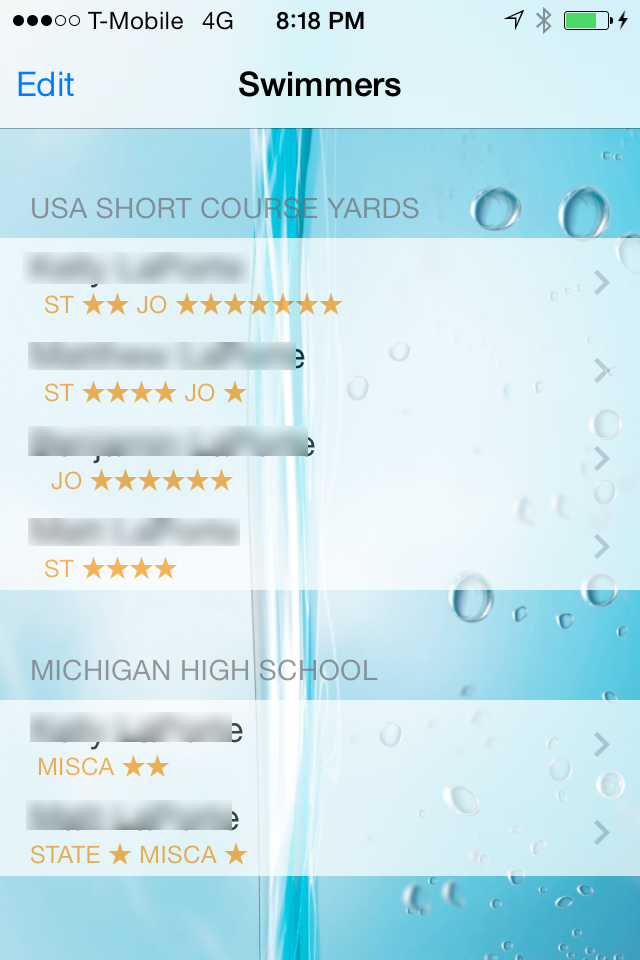
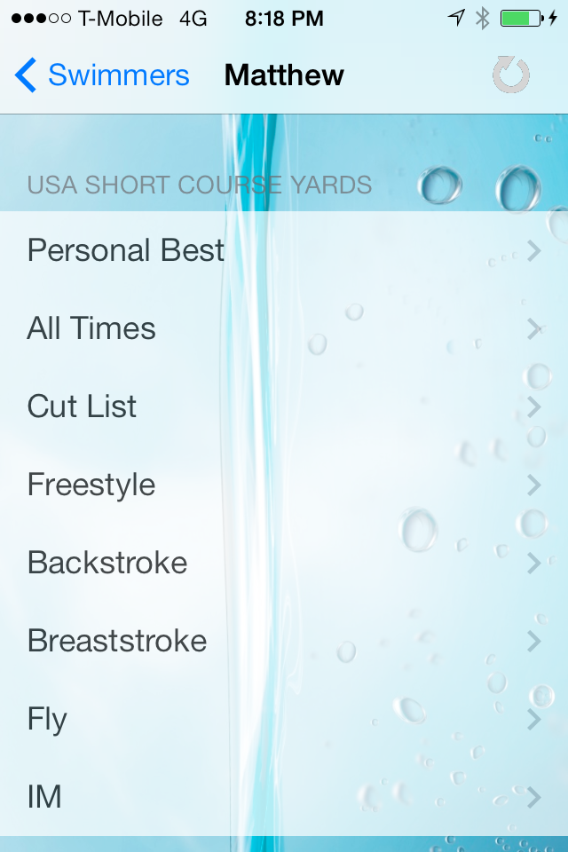
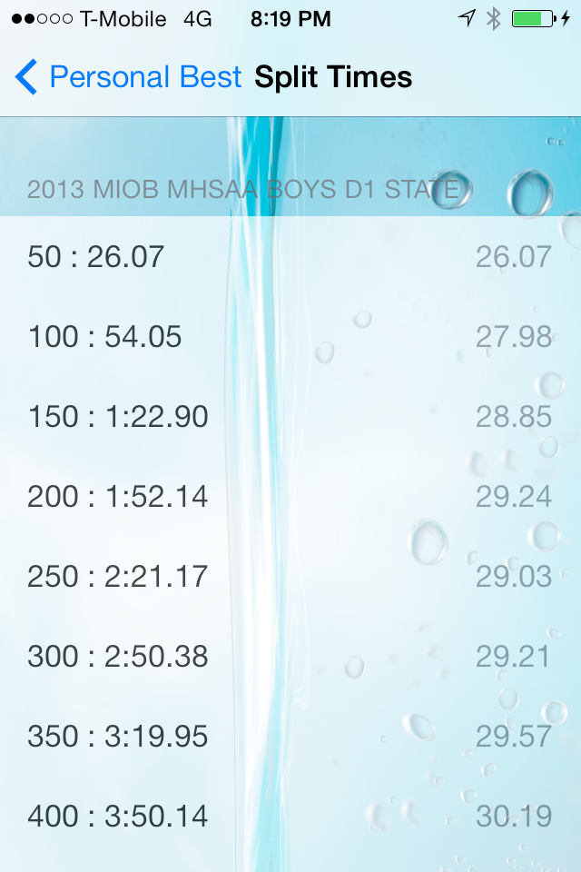

SimpleTimes
===========

iOS Application that keeps track of competitive swim times. Supports hand-entered times, or downloaded times.

Technologies used:

* Web scraping/HTML parsing
* Core Data for local storage
* `UITableView`s

Online downloads
----------------

The following Team Manager downloads are supported:

* USA Swimming times for the Michigan Swimming LSC 
* Michigan High School Athletic Association (MHSAA) via [MISCA](http://www.sports-tek.com/tmonline/index.asp?STRIPPED=MHSAAMISCAOfficeCopy)

Screenshots
-----------

Main screen

Report options

Personal Bests List

Race time with splits

